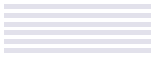
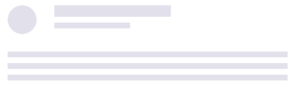
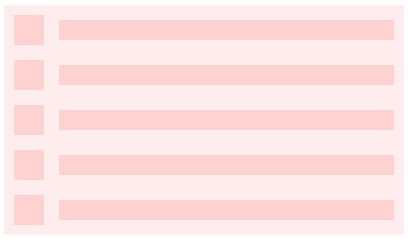

# Single div, dynamic, fully customizable CSS library.

## Documentation

[See full documentation](https://dgknca.github.io/css-skeletons/docs/)

## Getting Started

### Use from CDN

```html
<!-- UNPKG -->
<link rel="stylesheet" href="https://unpkg.com/css-skeletons@1.0.3/css/css-skeletons.min.css"/>

<!-- JSDelivr -->
<link rel="stylesheet" href="https://cdn.jsdelivr.net/npm/css-skeletons@1.0.3/css/css-skeletons.min.css"/>
```

or

### Install from NPM

```js
npm i css-skeletons
```

```js
import 'css-skeletons'
```

## Examples

A few example from [documentation](https://dgknca.github.io/css-skeletons/docs/).

```html
<div
  class="skeleton skeleton-line"
  style="
    --lines: 6; /* lines count */
    --l-h: 10px; /* line height */
    --l-gap: 8px; /* line gap */
"
></div>
```



```html
<div class="skeleton skeleton-card-3"></div>
```



```html
<div
  class="skeleton skeleton-list no-animate"
  style="
        --lines: 5;
        --bg: #ffb6b67d;
        --c-bg: #ff92922b;
        --bullet-ratio: 1.5;
        --l-gap: 15px;
"
></div>
```


